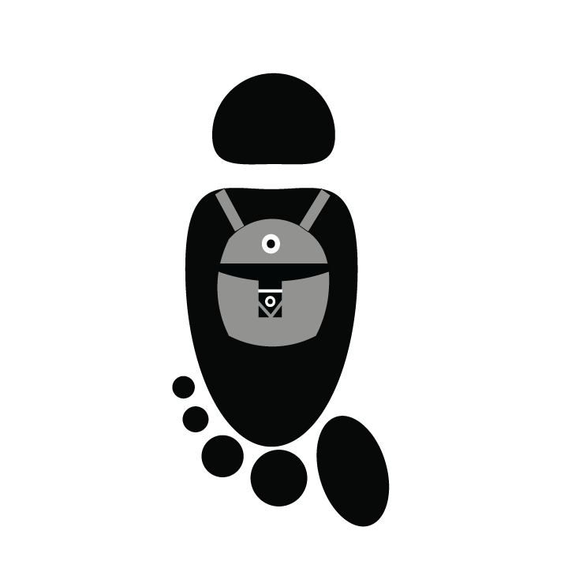

# Rucksac

<b>Inspiration</b> 
Many times people want to travel together but have to use a plethora of apps such as Splitwise, Google Maps, Whatsapp etc., to aid them in their journey. When friends want to travel together, it is required to have all these different apps which might be cumbersome. Our aim is to solve this problem by incorporating all travel related activities in a single app that would benefit all travelers.

 <b>What it does</b> 
The app will feature trip itinerary which will include the places they plan to visit, the time at which they wish to start and will also send out reminders to all users regarding upcoming activities. It also includes an in-app chat through which the travelers connect with each other during their journey and, share pictures and other media. Aside from chatting and itinerary features, the app also introduces wallet where each traveler can view the expenses incurred and pay the balances they owe to others during the trip.

<b>How we built it</b> 
Initially, in the design phase, we used Adobe XD to create and manage the screens. To provide interactivity and to understand the flow of the app, we imported the screens from Adobe XD to Marvel app and visualized the flow and direction of each screen in the app.

The app was developed using Android Studio and Firebase.

<b>Challenges we ran into</b> 
When we were developing the chat feature for the app, we realized that notifications weren't possible using GET and POST requests for Android versions above 6.

<b>Accomplishments that we're proud of</b> 
We were able to authenticate the app using Google Sign-in and create a miniature version of the chat screen without the notification. The designs of the screen and the interactivity of the different screens came out really well.

<b>What we learned</b> 
We learned on how to use Firebase, Android Studio and Adobe XD for this app

<b>What's next for Rucksac</b> 
We wish to make a fully functional app that includes all the features mentioned above and launch it in the playstore.

<b>Built With</b> 
Android Studio
Google Firebase
Adobe XD
Marvelapp

<b>Try it out</b> 
<a href = "https://marvelapp.com/44bdi7b/screen/40847852">Rucksac</a>

